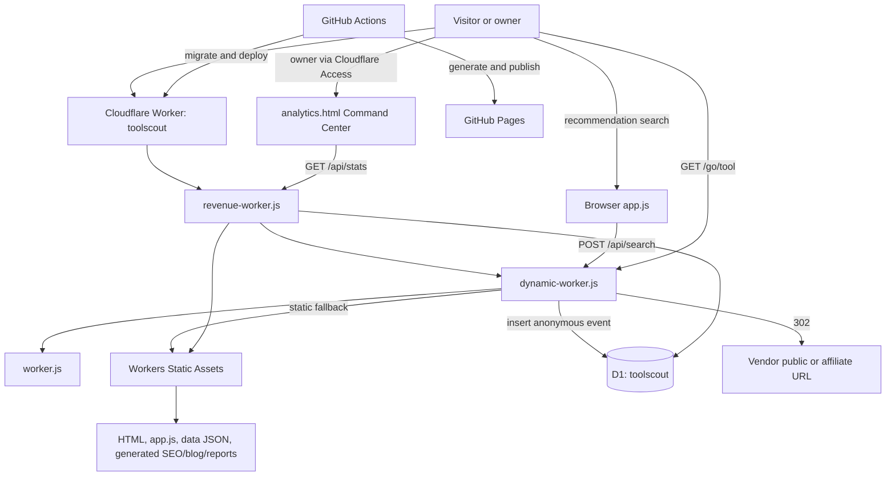

# ToolScout Production Baseline

## Snapshot

- Verified on: 2026-08-31 (Europe/Lisbon)
- Repository: `pcaiano/toolscout`
- Branch inspected: `main`
- Last verified source/deployed commit: `bae31514fd9361e24ade5201f2ec2fadbdef432e`
- Public origin: `https://trytoolscout.org`
- Worker health: `GET /api/health` returned `{"ok":true,"service":"toolscout-analytics"}`
- Legacy Worker origin: the compatibility URL defined as `LEGACY_BASE` in `production-smoke.yml`; its health endpoint also returned OK
- Production Worker workflow run 52: successful for the verified commit
- GitHub Pages workflow run 293: successful for the verified commit
- Post-deploy production smoke run 180 and scheduled smoke run 181: successful for the verified commit
- Production discovery in this snapshot was read-only. No deployment, migration, database write, binding change, route change, or other production mutation was performed.

This document describes observed and repository-backed state. Account-side Cloudflare metadata that could not be queried without credentials is identified as unverified rather than inferred.

## Project identity

The permanent identity and isolation boundary is defined in `AGENTS.md`:

| Resource | ToolScout identity |
| --- | --- |
| Repository | `pcaiano/toolscout` |
| Cloudflare Worker | `toolscout` |
| D1 database name | `toolscout` |
| D1 database ID | `cac6bc3c-d838-4edd-ba29-597030afb397` |
| Public domain | `trytoolscout.org` |

BEARING / Luxury Buyer Intelligence is a separate project and is out of scope. A historical hostname still appears in explicitly allowed compatibility code and as `LEGACY_BASE` in the production smoke test, but this does not make BEARING resources available to ToolScout. Never infer, reuse, modify, or repoint any other project resource.

Before an infrastructure-affecting operation, verify this chain:

`ToolScout repository -> exact ToolScout resource -> verified name/ID -> intended operation`

## Production architecture

ToolScout is a static, client-rendered application served through a Cloudflare Worker with Workers Static Assets and a D1 binding. The Worker handles API, tracked redirects, protected analytics, dynamic SEO fallbacks, sitemap merging, and scheduled maintenance before falling through to static assets.

The active Worker entry point is the root `revenue-worker.js`, selected by root `wrangler.toml`. It composes three layers:

1. `revenue-worker.js` augments authenticated `/api/stats` with evidence-backed Revenue Intelligence.
2. `dynamic-worker.js` provides current domain/auth behavior, tracking, affiliate redirects, SEO consolidation redirects, dynamic opportunity pages, and the dynamic sitemap.
3. `worker.js` provides base health, opportunity refresh, static asset fallback, and the scheduled maintenance/opportunity refresh implementation.

## Request/data flow

### Recommendation flow

1. `index.html` loads `app.js`.
2. `app.js` fetches `data/tools.json` and `data/intents.json`.
3. A free-text or guided query is normalized and matched to intent signals in the browser.
4. `scoreTool()` ranks the catalogue deterministically. Affiliate economics are not part of ranking.
5. The browser posts one `/api/search` event when results are rendered.
6. Result links point to `/go/<tool-slug>`.
7. The Worker records the outbound click and redirects to an enabled affiliate URL or the tool's public URL.

### Session identity

`app.js` creates an anonymous `toolscout_session` UUID in local storage and mirrors it into a six-month, `SameSite=Lax`, secure cookie. `/go/*` reads that cookie and creates a UUID if absent. No account is required. The event model stores no names, emails, raw IP addresses, or advertising IDs.

### Owner classification

The Command Center sets a `toolscout_owner=1` cookie. New search and click events from that browser are stored with `source = 'internal-test'`. Older events without this marker remain other/unclassified.

## Repository map

| Area | Canonical source | Generated/runtime output or consumer |
| --- | --- | --- |
| Public app shell | root HTML files | Workers Static Assets and GitHub Pages |
| Recommendation logic | `app.js` | Runs in browser |
| Tool catalogue | `data/tools.json` | App, SEO generators, Worker opportunity scoring |
| Intent catalogue | `data/intents.json` | App, generators, Worker opportunity scoring |
| Intent profiles | `data/intent-profiles.json` | Worker/growth scoring |
| Affiliate registry | `data/affiliate.json` | `/go/*`, stats coverage, generated pages |
| Affiliate pipeline/queue | `data/affiliate-pipeline.json`, `data/affiliate-queue.json` | Growth reports and human follow-up |
| Worker configuration | root `wrangler.toml` | Worker `toolscout`, assets, cron, D1 binding |
| Active Worker | `revenue-worker.js` plus imported root Worker layers | Cloudflare Worker deployment |
| D1 schema | root `migrations/0001` through `0006` | Applied automatically before Worker deploy |
| Owner UI | `analytics.html` | Protected Command Center |
| Older admin UI | `admin.html` | Token-prompt dashboard; excluded from asset upload by `.assetsignore` only indirectly through Worker access behavior, not by filename |
| Static SEO inputs | `data/intents.json`, `data/seo-longtail.json`, `data/seo-consolidations.json` | Root intent HTML pages |
| Blog inputs | intents and acquisition data | `blog/*.html`, `blog/index.html`, `reports/blog-topics.json` |
| Distribution inputs | intents, long-tail data, generated pages | `guides.html`, `feed.xml`, queue/report JSON |
| Sitemap source logic | `scripts/generate-sitemap.mjs` | `sitemap.xml`; Worker adds ready/published D1 opportunities at request time |
| Operational docs | `docs/` | Human/agent runbooks |

Current catalogue counts at this snapshot: 20 tools, 24 base intents, 24 intent profiles, 19 affiliate registry entries, 3 enabled affiliate routes, and 16 SEO consolidation aliases.

## Active vs legacy components

### Active

- Root `wrangler.toml` is the deployment configuration used by `.github/workflows/deploy-worker.yml`.
- Root `revenue-worker.js`, `dynamic-worker.js`, and `worker.js` form the deployed Worker implementation.
- Root `migrations/` is the configured D1 migration directory.
- Root static files and selected subdirectories are uploaded as Workers Static Assets; `.assetsignore` excludes repository/configuration/operational material.
- GitHub Pages independently generates and publishes a static copy from the repository root.

### Legacy or superseded

- `worker/src/index.js`, `worker/migrations/`, and `worker/wrangler.toml.example` describe an earlier `toolscout-analytics` Worker/D1 shape. They are not referenced by the active root Wrangler configuration or deployment workflow.
- `worker.js` contains older implementations of routes that `dynamic-worker.js` overrides. It remains active as the base layer for `/api/health`, `/api/opportunities/refresh`, asset fallback, and scheduled execution, so it must not be treated as wholly dead code.
- `admin.html` is an older bearer-token dashboard. `analytics.html` is the current Cloudflare Access-oriented Command Center. Both remain in the repository.
- `click.html` is a legacy client-side redirect/click log based on query parameters and local storage. Current recommendation and tool links use `/go/<slug>` instead.
- `scripts/generate-seo.mjs` and root `seo-intents.json` are an older SEO generation path. Current workflows use `scripts/generate-seo-pages.mjs` and `data/intents.json` plus long-tail/consolidation data.

Do not delete these paths solely from this classification. Reconcile callers and deployment history before removal in a dedicated maintenance mission.

## Cloudflare resources

### Verified from guarded repository configuration

- Worker name: `toolscout`
- Entry point: `revenue-worker.js`
- Compatibility date: `2026-08-29`
- Static asset directory: repository root (`.`)
- Asset binding: `ASSETS`
- HTML handling: `auto-trailing-slash`
- Not-found behavior: `404-page`
- D1 binding: `DB`
- D1 database: `toolscout`
- D1 database ID: `cac6bc3c-d838-4edd-ba29-597030afb397`
- Migration directory: `migrations`
- Cron trigger: `15 3 * * *`
- Secret referenced by code/workflows: `ADMIN_TOKEN`
- Deployment credential referenced by GitHub Actions: `CLOUDFLARE_API_TOKEN`

`run_worker_first` lists `/go/*` and specific dynamic/consolidated SEO paths. API behavior is also demonstrably handled by the deployed Worker because `/api/health` returns the Worker response on both the public and legacy origins.

### Account-side metadata not verified in this session

No Cloudflare API token/account ID was available locally. Therefore the account-side Worker route/custom-domain object, complete binding inventory, secret presence/value, deployment version ID, and remote D1 schema/data were not queried. The public domain, live Worker behavior, guarded repository identity, successful deployment workflow, and deployed commit are verified; account-side metadata must be rechecked with read-only Wrangler/API access before any infrastructure mutation.

The repository contains no explicit `routes` or `workers_dev` declaration. The exact account-side mechanism connecting `trytoolscout.org` to the Worker is therefore external configuration, not a fact established by `wrangler.toml`.

## Database schema

The canonical repository schema is the ordered root migration set:

| Migration | Object | Purpose and constraints |
| --- | --- | --- |
| `0001_click_events.sql` | `click_events` | Outbound/tool click events; required tool, intent, session, source, timestamp; indexes on tool, intent, created time |
| `0002_search_events.sql` | `search_events` | Recommendation-result/search events; required intent, serialized profile, session, source, timestamp; indexes on intent and created time |
| `0003_seo_opportunities.sql` | `seo_opportunities` | Unique intent opportunity score/status and timestamps; indexes on status and descending score |
| `0004_tool_health.sql` | `tool_health` | HTTP health observations by tool; indexes on tool and checked time |
| `0005_sessions.sql` | `sessions` | Anonymous session registry with source/owner flag and first/last seen timestamps; primary key on session ID plus source/owner/time indexes |
| `0006_revenue_ledger.sql` | `revenue_ledger` | Evidence-backed vendor conversion/commission ledger with lifecycle and attribution checks |

`revenue_ledger` permits only `pending`, `confirmed`, `paid`, or `reversed` status and only `unattributed`, `attributed`, or `vendor_confirmed` attribution status. `(affiliate_slug, conversion_id)` is unique when a conversion ID exists. Additional indexes cover affiliate, status, attribution, tool, intent, session, and reporting period.

There are no repository-defined SQL views in the active migration tree. The old `worker/migrations/0002_analytics_views.sql` is named as views but creates only two indexes and belongs to the legacy tree.

### Schema/application drift

- `sessions` exists in migrations but current Worker code never inserts or updates it.
- `tool_health` exists in migrations but the current scheduled handler does not populate it; `docs/HEALTH_CHECKER.md` still describes this as a next implementation.
- Current “session” analytics query distinct `session_id` from `click_events`; they do not query the `sessions` table and therefore exclude visitors who never click.
- The application writes outbound clicks through `/go/*`. `/api/click` is available but no current public JavaScript caller was found.
- Current search tracking serializes a profile that can contain the user's truncated free-text query. It is anonymous but is broader than a strictly structured event payload and should be reviewed in M01.
- The remote migration ledger/schema could not be directly inspected without Cloudflare credentials. Successful deploy workflow runs imply the migration command completed but do not independently prove that no out-of-band schema drift exists.

## Analytics/tracking

| Metric/event | Source of truth | Storage | Collection point/API | UI consumer |
| --- | --- | --- | --- | --- |
| Recommendation/search result rendered | `search_events` row | D1 `search_events` | `app.js` -> `POST /api/search` | `analytics.html`, opportunity scoring, content signals |
| Anonymous outbound click | `click_events` row | D1 `click_events` | Primary: `GET /go/<slug>`; optional `POST /api/click` | `analytics.html`, `admin.html`, `opportunity-matrix.html`, Revenue Opportunity |
| Click sessions | distinct click `session_id` | D1 `click_events` | Derived by `/api/stats` | Command Center |
| Search sessions by intent | distinct search `session_id` | D1 `search_events` | Derived by `/api/stats` and `/api/content-signals` | Command Center and SEO/content automation |
| Acquisition source | event `source` | D1 click/search tables | UTM/source/referrer classification in `app.js`; redirect source in Worker | Command Center |
| Owner/internal activity | `source = internal-test` | D1 click/search tables | `toolscout_owner=1` cookie | Command Center audience split |
| SEO opportunity | `seo_opportunities` row | D1 `seo_opportunities` | Authenticated refresh route and daily scheduled refresh | Dynamic pages, sitemap, Command Center |
| Vendor conversion/revenue | evidence ledger row | D1 `revenue_ledger` | Reviewed SQL generated by import script; no public ingestion API | `/api/stats` Revenue Intelligence and Command Center |

Currently not recorded as canonical events: page views, landing sessions without a click, recommendation start, guided-flow steps, recommendation completion distinct from search result rendering, recommendation result impressions, individual tool page views, return visits, or verified conversion events outside the revenue ledger.

`/api/stats` is protected. On the public host it requires Cloudflare Access identity `pcaiano@gmail.com`; on a non-public/legacy host the code supports a bearer `ADMIN_TOKEN`. An unauthenticated public request was redirected by the live access layer during this audit and did not expose metrics.

## Revenue Intelligence

`revenue-worker.js` is the active top Worker layer. It reads up to 5,000 recent ledger rows and adds a `revenue` object to authenticated stats.

It reports:

- reporting connection state;
- unique vendor conversion IDs when evidence exists;
- confirmed plus paid commission;
- pending commission;
- paid commission;
- currency or mixed-currency state;
- ledger evidence count/latest evidence timestamp;
- revenue per 1,000 non-owner click sessions only when a single-currency confirmed value and denominator exist;
- a directional, explicitly non-euro monetization opportunity score for clicked tools without active affiliate coverage.

When the ledger is absent or contains no evidence, revenue remains unavailable/unknown rather than being inferred from clicks. Raw vendor exports are not committed. `scripts/import-revenue-ledger.mjs` accepts only the explicitly supported `systeme-io`, `beehiiv`, and `jotform` program slugs and generates reviewable SQL; it does not apply that SQL.

## Affiliate system

`data/affiliate.json` is the runtime affiliate source of truth. Each tool can have a public URL and an optional enabled, verified affiliate URL. The Worker chooses an enabled affiliate URL first and otherwise the public URL, records the click, and issues a 302.

At this snapshot, 19 tools have registry entries and these three affiliate routes are enabled:

- `systeme-io`
- `beehiiv`
- `jotform`

`data/affiliate-pipeline.json`, `data/affiliate-queue.json`, and the affiliate documentation hold research/application workflow data. They do not override the runtime registry. Affiliate coverage affects reporting and prioritization, not recommendation ranking.

## SEO engine

The current static SEO pipeline is source-controlled and review-gated:

1. Validate catalogue/intent coverage.
2. Build growth priority from catalogue, intent, affiliate, and pipeline data.
3. Generate intent pages from 24 base intents plus approved long-tail inputs.
4. Generate blog topics and missing blog pages.
5. Generate distribution assets and a clean guide index.
6. Build the distribution queue.
7. Generate sitemap, feed, and supporting discovery files.
8. Validate pages, canonicals, affiliate surface, and the public hostname.
9. Commit only changed generated assets through the SEO workflow bot.

Canonical inputs include `data/intents.json`, `data/tools.json`, `data/intent-profiles.json`, `data/seo-longtail.json`, `data/seo-consolidations.json`, and `data/seo-clusters.json`. Root intent HTML, `blog/*.html`, `guides.html`, `feed.xml`, `sitemap.xml`, `llms.txt`, and JSON files in `reports/` are generated or partially generated outputs.

Duplicate/cannibalization control is explicit in `data/seo-consolidations.json`. The Worker returns permanent redirects from consolidated slugs to canonical pages and excludes consolidated aliases when augmenting the sitemap.

The dynamic SEO layer uses D1 `seo_opportunities`: a missing static `<intent>.html` page may be rendered dynamically only when its status is `ready` or `published`. Dynamic sitemap output merges static sitemap URLs with eligible, non-consolidated D1 opportunities.

`docs/SEO_PAGE_POLICY.md` requires human approval before publishing new SEO pages. Automation may discover and score candidates but must not silently publish thin or speculative pages.

## Distribution engine

The repository already contains a distribution/acquisition pipeline; it should be evolved, not rebuilt.

- `scripts/generate-distribution.mjs` produces the feed and guide surface.
- `scripts/build-distribution-index.mjs` rebuilds the guide index from generated pages.
- `scripts/build-distribution-queue.mjs` produces `reports/distribution-queue.json`.
- `scripts/build-growth-priority.mjs` produces `reports/growth-priority.json` from catalogue/intent/affiliate signals.
- `scripts/generate-acquisition-content.mjs` generates configured acquisition articles.
- `scripts/generate-acquisition-priority.mjs` combines content/page/distribution readiness into `reports/acquisition-priority.json` when run.
- `data/acquisition-content.json` is the acquisition-content configuration.
- Product Hunt copy, checks, sequencing, and readiness criteria are documented in `docs/product-hunt-launch.md`; they are assets/checklists, not an automated external post.

External/community distribution remains approval-led. The repository does not establish that queued content has been posted externally.

## CI/CD

| Workflow | Trigger | Behavior |
| --- | --- | --- |
| Deploy ToolScout Worker | push to `main`, manual | Applies root D1 migrations remotely, then deploys root Wrangler config with `--latest` |
| Deploy ToolScout to GitHub Pages | push, daily, manual | Regenerates selected SEO/acquisition/sitemap output, validates hostname, uploads repository-root artifact, deploys Pages |
| Generate SEO Pages | relevant source changes, daily, manual | Runs the full generate/validate pipeline and commits changed generated assets back to `main` |
| ToolScout health check | push, daily, manual | Validates tool data and checks vendor source URLs; only network/5xx failures are hard failures |
| Production Smoke Test | after successful Worker deploy, hourly, manual | Checks health, robots, sitemap, core pages, analytics protection, canonical/redirect behavior, tracked affiliate destinations, and legacy Worker health |

Important coupling: every push to `main`, including a documentation-only push, triggers the Worker workflow, which applies pending migrations and deploys. The SEO bot's generated commit can in turn trigger the deployment workflows. Production changes should therefore be merged only when all generated assets and migrations have been reviewed.

GitHub Pages and the Worker both publish static assets, but the custom production origin demonstrably executes Worker routes. Treat Pages as an independent static deployment/mirror unless account-side domain settings prove a different role.

## Smoke/health checks

The safe production acceptance surface is:

- `/api/health` returns an OK ToolScout service response;
- `robots.txt` points to `https://trytoolscout.org/sitemap.xml`;
- sitemap is valid and includes core/legal/methodology/intent pages;
- core pages and generated report JSON return successfully;
- unauthenticated users cannot access Command Center metrics;
- dynamic pages use `trytoolscout.org` canonicals;
- consolidation aliases return 301 to the canonical ToolScout URL;
- enabled `/go/*` routes return 302 to the expected vendor host with a verified tracking parameter;
- the legacy Worker health endpoint remains available while it is part of the compatibility contract.

Local pre-release checks should include all repository validation scripts and JavaScript syntax checks. Generation should then be run and the resulting diff reviewed; generated timestamps mean it must not be treated as a read-only command.

## Sources of truth

| Question | Source of truth |
| --- | --- |
| Project/resource identity | `AGENTS.md`, then verified account metadata before mutation |
| Active Worker composition | root `wrangler.toml` and imported Worker files |
| Deployment behavior | `.github/workflows/deploy-worker.yml` |
| D1 schema | root ordered migrations, checked against remote D1 before a schema-sensitive change |
| Tool facts/scoring input | `data/tools.json` and cited/verified source metadata |
| Recommendation algorithm | `app.js` plus `docs/RECOMMENDATION_ENGINE.md` |
| Runtime affiliate destination | `data/affiliate.json` |
| Affiliate research/application state | affiliate data queues/pipeline plus official evidence and docs |
| Outbound clicks/searches | D1 `click_events` / `search_events` |
| Verified revenue | D1 `revenue_ledger` rows backed by vendor evidence |
| SEO canonical intent set | base/long-tail inputs minus `data/seo-consolidations.json` aliases |
| Generated distribution priorities | reports generated from the corresponding scripts/inputs |
| Live health/deploy state | public smoke checks plus GitHub workflow runs |

## Known technical debt

- Active Worker behavior is spread over three increasingly layered root files, with substantial duplication between `worker.js` and `dynamic-worker.js`.
- A second legacy Worker tree and two admin surfaces remain in the repository without an explicit deprecation marker in filenames.
- `sessions` and `tool_health` schemas are ahead of their application usage.
- `/api/click` is exposed but has no current public caller; `/go/*` is the effective outbound collection point.
- CORS allows any origin on public ingestion endpoints and there is no explicit rate limiting/bot classification in application code.
- Recommendation/search tracking can store up to 500 characters of free-text query inside `profile_json`.
- `app.js` ignores ingestion response status, so a failed analytics write does not affect UX and is not observable client-side.
- Event ingestion and redirect writes have no explicit stable client event/click ID or deduplication key.
- Current stats query lifetime totals in several places and labels distinct click IDs as sessions; time-window semantics are inconsistent.
- `revenue_ledger.amount` and `commission` are non-null numeric fields defaulting to zero. Safety depends on the importer rule that no row exists without vendor evidence.
- No automated unit/integration test suite exists; confidence comes from static validators, syntax checks, workflows, and production smoke tests.
- `docs/DEPLOY.md` still references the obsolete `toolscout-db` creation name and generic creation steps. For the existing production project, `AGENTS.md` and root `wrangler.toml` override it; do not create a replacement database.
- The active scheduled handler still uses the legacy Worker hostname internally for asset URLs. This is allowed by the hostname guard and works today, but should be reconciled deliberately rather than changed during discovery.

## Known product gaps

- No complete funnel from landing session through recommendation start/completion, result view, tool view, and outbound click.
- Visitors who do not click are absent from current “session” totals.
- Recommendation completion currently approximates one recorded search/result render; start and completion are not separate events.
- No page/tool-view or result-impression event.
- No reliable click-to-conversion linkage; `revenue_ledger.click_id` exists but current click identity/propagation is not implemented.
- Vendor-verified revenue may be stored, but attribution remains unknown unless independently supported by evidence.
- No bot exclusion beyond owner-cookie classification and no durable internal/test-event policy for all automated traffic.
- Tool health schema exists without the planned scheduled collection/review surface.

These gaps are inputs to later missions, not authorization to implement features in M00.

## External/manual dependencies

- Cloudflare account access is needed to verify account-side routes/custom domains, bindings, secrets, deployment version, and remote D1 schema/migration ledger.
- Cloudflare Access policy/identity is configured outside the repository and is required for the current public-host Command Center.
- GitHub Actions secret `CLOUDFLARE_API_TOKEN` is required for deployment; its existence is evidenced by successful workflows, not inspected directly.
- Affiliate approval, exact tracking URLs, vendor reporting, and revenue evidence remain vendor/human inputs.
- Search Console submission, Product Hunt launch, and community distribution are external actions and are not proven by repository queues.

## Safe deployment procedure

1. Read `AGENTS.md`, this baseline, and `README.md`.
2. Confirm repository `pcaiano/toolscout`, intended branch/commit, and a clean worktree.
3. Inspect all pending migrations. Before any remote command, explicitly verify Worker `toolscout` and D1 `toolscout` / `cac6bc3c-d838-4edd-ba29-597030afb397` through account-side read-only metadata.
4. Run catalogue, intent, SEO, public-surface, hostname, and JavaScript syntax checks.
5. Run generators when their inputs changed; review every generated diff and consolidation/canonical change.
6. Commit only scoped ToolScout changes. Never include credentials, raw vendor exports, private identifiers, or unrelated project files.
7. Push/merge only with awareness that `main` automatically applies D1 migrations and deploys the Worker, and also deploys Pages.
8. Confirm the Worker workflow completes successfully, then confirm the post-deploy smoke workflow.
9. Re-run/read the production acceptance surface above. For schema/revenue work, validate authenticated stats without copying sensitive output into logs.
10. If resource identity differs or cannot be verified, stop before migration/deployment. Do not repair by creating, rebinding, or repointing infrastructure speculatively.

## Last verified commit/date

- Source commit: `bae31514fd9361e24ade5201f2ec2fadbdef432e`
- Commit subject: `Document evidence-based affiliate revenue imports`
- Commit timestamp: 2026-08-31 18:22:35 +01:00
- Worker deployment workflow: successful on that commit (run 52)
- Pages deployment workflow: successful on that commit (run 293)
- Post-deploy production smoke: successful on that commit (run 180)
- Later scheduled production smoke: successful on that commit (run 181)
- Baseline verification date: 2026-08-31

The documentation commit created by M00 is not claimed as deployed because M00 does not push or deploy automatically. Update this section after the next authorized production deployment.
